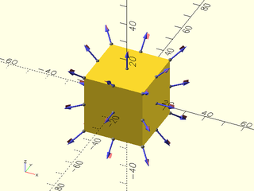
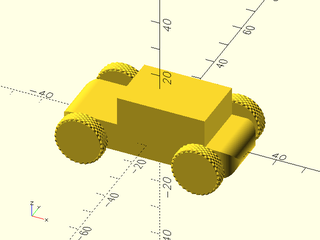
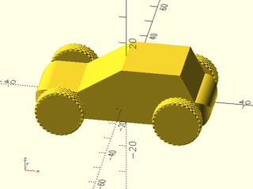

# BOSL2 Introduction

This tutorial is intended to roughly parallel the first few chapters of the [OpenSCAD tutorial](https://en.wikibooks.org/wiki/OpenSCAD_Tutorial). It is intended to help beginners understand how the BOSL2 library simplifies the use of OpenSCAD.

If you have never used OpenSCAD before, you should review the first few sections of the OpenSCAD Tutorial up to the section titled "Adding More Objects..."

The OpenSCAD Tutorial begins with a discussion of the cube().  While BOSL2 includes a somewhat improved version of [cube()](https://github.com/BelfrySCAD/BOSL2/wiki/shapes3d.scad#functionmodule-cube), there is a more versatile shape called a [cuboid()](https://github.com/BelfrySCAD/BOSL2/wiki/shapes3d.scad#module-cuboid) that we will use here.

In discussing cubiods and other BOSL2 objects we refer to named [directions](https://github.com/BelfrySCAD/BOSL2/wiki/attachments.scad#subsection-specifying-directions), [faces](https://github.com/BelfrySCAD/BOSL2/wiki/attachments.scad#subsection-specifying-faces), [edges](https://github.com/BelfrySCAD/BOSL2/wiki/attachments.scad#subsection-specifying-edges), and [corners](https://github.com/BelfrySCAD/BOSL2/wiki/attachments.scad#subsection-specifying-corners).  Take a few moments now to familiarize yourself with that terminology.

To use BOSL2 library elements in our model we must add this line to the top of our file:

```text
include<BOSL2/std.scad>
```

Each basic BOSL2 shape has a set of [anchors](https://github.com/BelfrySCAD/BOSL2/wiki/utorial-Attachment-Basic-Positioning#anchoring).

```openscad
include<BOSL2/std.scad>
cuboid(30) show_anchors();
```


The default anchor for any BOSL2 object is the CENTER, so in the example above the center anchor is positioned at the origin.  We can change that by using the anchor argument.

```openscad
include<BOSL2/std.scad>
cuboid(30, anchor = BOTTOM+FORWARD+LEFT) show_anchors();
```


We'll pick up the OpenSCAD Tutorial with the example in "Adding More Objects..." called "two_cubes_barely_touching.scad".  It looks like this:

```openscad
cube([60,20,10],center=true);
translate([0,0,10])
cube([30,20,10],center=true);
```


Because all of the objects in BOSL2 are centered on the origin by defualt, we don't have to specify that if we use cuboid(). To do that we need to include the BOSL2 Library in our code:

```openscad
include<BOSL2/std.scad>
cuboid([60,20,10]);
translate([0,0,10])
cuboid([30,20,10]);
```


But BOSL2 includes a number of [ways to move objects](https://github.com/BelfrySCAD/BOSL2/wiki/transforms.scad) that are easier to use than is translate():

```openscad
include<BOSL2/std.scad>
cuboid([60,20,10]);
up(10)
cuboid([30,20,10]);
```


At this point in the OpenSCAD tutorial it descends into a lengthy discussion of how there could concievably be an infintesimal gap between the two cubes.  (Perhaps due to the limited precision of floating point math?)

BOSL2 obviates this is concern by making objects [attachable](https://github.com/BelfrySCAD/BOSL2/wiki/Tutorial-Attachment-Overview#attachments-overview) to each other. We'll use the BOTTOM anchor on the second cuboid and attach that to the TOP anchor on the first cuboid.

```openscad
include<BOSL2/std.scad>
cuboid([60,20,10])
    position(TOP) cuboid([30,20,10], anchor = BOT);
```


Before the OpenSCAD Tutorial adds the first wheel it changes the position of the top cube 5 to the right of it's initial positon.
Again we do that with a more readable translation operator:

```openscad
include<BOSL2/std.scad>
cuboid([60,20,10])
    position(TOP) right(5) cuboid([30,20,10], anchor = BOT);
```


Since the cylinder shape that the OpenSCAD tutorial uses for the wheels can only create a cylinder whose axis is aligned with the Z axis, their solution begins by hiding the weel under the body of the model.  Here's we'e using the BOSL2's ghost() module to see inside their model.

```openscad
include<BOSL2/std.scad> // <-- Required to make ghost() work

// from the OpenSCAD Tutorial "a_cylinder_covered_by_cubes.scad"

ghost() cube([60,20,10],center=true);
translate([5,0,10 - 0.001])
    ghost() cube([30,20,10],center=true);
cylinder(h=3,r=8);
```


The OpenSCAD Tutorial repeatedly invokes rotate() and translate() to arrange the cylinders in the proper wheel positions:

```openscad
cube([60,20,10],center=true);
translate([5,0,10 - 0.001])
    cube([30,20,10],center=true);
translate([-20,-15,0])
    rotate([90,0,0])
    cylinder(h=3,r=8,center=true);
translate([-20,15,0])
    rotate([90,0,0])
    cylinder(h=3,r=8,center=true);
translate([20,-15,0])
    rotate([90,0,0])
    cylinder(h=3,r=8,center=true);
translate([20,15,0])
    rotate([90,0,0])
    cylinder(h=3,r=8,center=true);
```


BOSL2 has a cyl() object that is to OpenSCAD's cylinder() what cuboid() is to cube().  Unlike OpenSCAD's cylinder(), we can change the orientation of the cyl() object (and all other attachable BOSL2 objects) with the '"orient" argument.

For our BOSL2 car we'll use a y-axis oriented [cyl()](https://github.com/BelfrySCAD/BOSL2/wiki/shapes3d.scad#module-cyl) for the wheel, and rather than duplicating the code 4 times, we'll make use of
a module called [grid_copies()](https://github.com/BelfrySCAD/BOSL2/wiki/distributors.scad#functionmodule-grid_copies) from BOSL2's collection of [distributors](https://github.com/BelfrySCAD/BOSL2/wiki/distributors.scad).

Here we're using two argumets to grid_copies(), *n*__ given as [ROWS,COLUMNS], and *spacing*, the [XY] size over which to spread the copies.

```openscad
include<BOSL2/std.scad>
cuboid([60,20,10])
    position(TOP) right(5) cuboid([30,20,10], anchor = BOT);
grid_copies(n=[2,2], spacing = [40,30]) cyl(h=3, r=8, orient = BACK);
```


Our car is still missing axles to connect the wheels to the body.  The OpenSCAD tutorial leaves these as an exercise for the reader, but we'll use them to introduce two new things.  First we'll use ycyl(), this is like cyl() with orient=BACK, BOSL2 also has xcyl() and zcyl(). (Although zcyl() and cyl() produce cylinders with the same orientation). The second new thing is another distributor, [xcopies](https://github.com/BelfrySCAD/BOSL2/wiki/distributors.scad#functionmodule-xcopies) that lets us place copies of an object along the x-axis.

```openscad
include<BOSL2/std.scad>
cuboid([60,20,10])
    position(TOP) right(5) cuboid([30,20,10], anchor = BOT);
grid_copies(n=[2,2], spacing = [40,30]) cyl(h=3, r=8, orient = BACK);
xcopies(n=2, spacing = 40) ycyl(h=30, r = 2);
```


At this point the OpenSCAD Tutorial suggests adding $fa = 1; and $fs = 0.4; to the beginning of the file to smooth
the cylindrical parts of the model, but it doesn't explain how they work.

```openscad
include<BOSL2/std.scad>
$fa = 1;
$fs = 0.4;
cuboid([60,20,10])
    position(TOP) right(5) cuboid([30,20,10], anchor = BOT);
grid_copies(n=[2,2], spacing = [40,30]) cyl(h=3, r=8, orient = BACK);
xcopies(n=2, spacing = 40) ycyl(h=30, r = 2);
```


In OpenSCAD, the special variables $fa, $fs, and $fn control how curved shapes (like circles, spheres, and cylinders) are approximated using flat segments. These variables affect the number of facets (segments) used to represent curves, allowing you to balance rendering quality and performance.

$fa – Minimum Angle (Fragment Angle) specifies the minimum angle (in degrees) between adjacent fragments. Smaller values increase the number of segments, improving smoothness. $fa defaults to 12.  

$fs – Minimum Size (Fragment Size) specifies the minimum length (in mm) of each fragment along the arc. Smaller values result in more, shorter segments.  $fs defaults to 2.

If you specify both $fa and $fn OpenSCAD computes the number of segments in a circle as:

```text
segments = max(360 / $fa, diameter * PI / $fs)
```

Alternatively you can override both $fa and $fs by using $fn to directly specify the number of segments.  

```text
$fn = 72;
```

## Beyond OpenSCAD

Let's depart from the OpenSCAD tutorial for a while and add to our model in ways that illustrate how BOSL2 objects differ from their OpenSCAD counterparts.

We can start with the tires. BOSL2's cyl() support rounding and chamfering of the ends of the cylinder.
Let's widen the tires from 3 to 4 and round the edges by 0.5.

```openscad
include<BOSL2/std.scad>
$fa = 1;
$fs = 0.4;
cuboid([60,20,10])
    position(TOP) right(5) cuboid([30,20,10], anchor = BOT);
grid_copies(n=[2,2], spacing = [40,30]) cyl(h=4, r=8, orient=BACK, rounding = 0.5);
xcopies(n=2, spacing = 40) ycyl(h=30, r = 2);
```


Those look more like tires, but real tires have tread.  Let's make them more realistic.  We do that by adding texture to the cyl(). There are more than dozen [built-in textures](https://github.com/BelfrySCAD/BOSL2/wiki/skin.scad#section-texturing) in BOLS2, and ways to [add your own](https://github.com/BelfrySCAD/BOSL2/wiki/skin.scad#section-introduction-to-texturing).

```openscad
include<BOSL2/std.scad>
$fa = 1;
$fs = 0.4;
cuboid([60,20,10])
    position(TOP) right(5) cuboid([30,20,10], anchor = BOT);
grid_copies(n=[2,2], spacing = [40,30]) 
    cyl(h=4, r=8, rounding = 0.5, orient = BACK, texture= "cubes", tex_reps = [30,4], tex_depth = 0.5);
xcopies(n=2, spacing = 40) ycyl(h=30, r = 2);
```


Let's make our car a bit more streamlined by rounding some of the edges of the bottom cuboid.  We'll specify a rounding radius of 5 and a list of the edges we want to round.  In this case we'll round the edges on the left and right ends of the cuboid.  For a detailed discussion of edge rounding of cube-like objects, see the tutorial [Rounding the Cube](https://github.com/BelfrySCAD/BOSL2/wiki/Tutorial-Rounding_the_Cube).

```openscad
include<BOSL2/std.scad>
$fa = 1;
$fs = 0.4;
cuboid([60,20,10], rounding = 5, edges = [LEFT,RIGHT])
     position(TOP) right(5) cuboid([30,20,10], anchor = BOT);
grid_copies(n=[2,2], spacing = [40,30]) 
    cyl(h=4, r=8, rounding = 0.5, orient = BACK, texture= "cubes", tex_reps = [30,4], tex_depth = 0.5);
xcopies(n=2, spacing = 40) ycyl(h=30, r = 2);
```


We can make our model look less like an old Model-T Ford by changing the top cuboid() to a BOSL2 shape called a [prismoid()](https://github.com/BelfrySCAD/BOSL2/wiki/shapes3d.scad#functionmodule-prismoid). The prismoid() is another of BOSL2's cube-like objects. It lets us specify different sizes for the top and bottom as well as being able to shift the location of the top relative to the bottom.

```openscad
include<BOSL2/std.scad>
$fa = 1;
$fs = 0.4;
cuboid([60,20,10], rounding = 5, edges = [LEFT,RIGHT])
    position(TOP) right(5) prismoid(size1 = [40,20], size2 = [20,20], shift = [5,0], h = 10, anchor = BOT);
grid_copies(n=[2,2], spacing = [40,30]) 
    cyl(h=4, r=8, rounding = 0.5, orient = BACK, texture= "cubes", tex_reps = [30,4], tex_depth = 0.5);
xcopies(n=2, spacing = 40) ycyl(h=30, r = 2);
```


The prismoid() also lets us round the vertical-ish edges:

```openscad
include<BOSL2/std.scad>
$fa = 1;
$fs = 0.4;
cuboid([60,20,10], rounding = 5, edges = [LEFT,RIGHT])
    position(TOP) right(5) prismoid(size1 = [40,20], size2 = [20,20], shift = [5,0], h = 10, rounding = 3, anchor = BOT);
grid_copies(n=[2,2], spacing = [40,30]) 
    cyl(h=4, r=8, rounding = 0.5, orient = BACK, texture= "cubes", tex_reps = [30,4], tex_depth = 0.5);
xcopies(n=2, spacing = 40) ycyl(h=30, r = 2);
```

